# Detector
使用PyTorch实现了经典的深度学习检测算法：
* [OverFeat](#overfeat)(2013.12)
* [R-CNN](#r-cnn)(2013.11)
* [SPP-net](#spp-net)(2014.6)
* [Fast R-CNN](#fast)(2015.4)
* [**Faster R-CNN**](#faster)(2015.6)
* [FCN](#fcn)(2014.11)
* [R-FCN](#r-fcn)(2016.05)
* [FPN](#fpn)(2016.12)
* [Mask R-CNN](#mask)(2017.3)
* [Mask^X R-CNN](#maskx)(2017.11)
* [DetectorNet](#detectornet)(2013)
* [DenseBox](#densebox)(2015.9)
* [YOLO](#yolo)(2015.6)
* [YOLO9000](#yolo9000)(2016.12)
* [YOLOv3](#yolov3)(2018.3)
* [SSD](#ssd)(2015.12)
* [DSSD](#dssd)(2017.1)
* [RetinaNet](#retinanet)(2017.8)

------
## Requisites:
* anaconda
* pytorch-0.3.0
* torchvision
* visdom

------
## 经典的传统目标检测算法
* Haar + AdaBoost
    * 参考论文1：Rapid Object Detection using a Boosted Cascade of Simple Features,
    Viola & Jones, 2001
    * 参考论文2：Robust Real-Time Face Detection, Viola & Jones, 2002
    * 参考论文3：Informed Haar-Like Features Improve Pedestrian Detection,
    ShanShan Zhang等, 2014
* LBP + AdaBoost
    * 参考论文1：Multiresolution gray-scale and rotation invariant 
    texture classification with local binary patterns, Ojala等, 2002
    * 参考论文2：Learning Multi-scale Block Local Binary Patterns for Face Recognition,
    Shengcai Liao, 2007
    * 参考论文3：局部二值模式方法研究与展望, 宋克臣, 2013
* HOG + SVM(Cascade)
    * 参考论文1：Histograms of Oriented Gradients for Human Detection,
    Dalal & Triggs, 2005
    * 参考论文2：Fast Human Detection Using a Cascade of Histograms of Oriented 
    Gradients, Qiang Zhu等, 2006
* ACF + AdaBoost
    * 参考论文1：Integral Channel Features, Piotr Dollar等, 2009
    * 参考论文2：Fast Feature Pyramids for Object Detection, Piotr Dollar等, 2014
    * 参考论文3：Local Decorrelation For Improved Detection, Piotr Dollar等, 2014
* DPM
    * 参考论文1：A Discriminatively Trained, Multiscale, Deformable Part Model,
    Pedro等， 2008
    * 参考论文2：Object Detection with Discriminatively Trained Part Based Models,
    Pedro & ross等, 2010
    * 参考论文3：Visual Object Detection with Deformable Part Models, Pedro & ross等,
    2013
    * 参考论文4：Deformable Part Models are Convolutoinal Neural Networks,
    ross等, 2015  
本工程主要实现基于深度学习的检测算法，对传统算法感兴趣的同学可以阅读上面列出的论文，或相关博客。

[返回顶部](#detector)

------
## 前排膜拜大牛
* Ross Girshick(rbg): [个人主页](http://www.rossgirshick.info/), 主要成就：
    * DPM
    * R-CNN
    * Fast R-CNN
    * Faster R-CNN
    * YOLO
* Kaiming He(何恺明): [个人主页](http://kaiminghe.com/), 主要成就：
    * 2003年广东省理科高考状元
    * 图像去雾
    * ResNet
    * MSRA 初始化
    * Group 正则化
    * PReLU
    * SPPNet
    * Faster R-CNN
    * Mask R-CNN
    * Mask^X R-CNN
    * 炉石传说

[返回顶部](#detector)

------
## OverFeat
[OverFeat](https://arxiv.org/abs/1312.6229)
通过一个卷积网络来同时进行分类，定位和检测三个计算机视觉任务。

### 基础知识
* 卷积网络在小数据集上作用不明显
* 卷积网络最大的优点是不用人工设计特征;最大的缺点是需要大量标注的数据。

### offset max-pooling
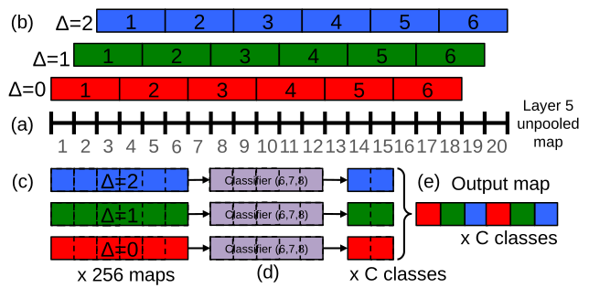
* Pooling时每次的起点不一样，Pooling后得到了3\*3\*C个特征图
* 该操作可以作为最后一层Pooling的方法，移除了Poolig操作本应该带来的分辨率损失

### FCN in test
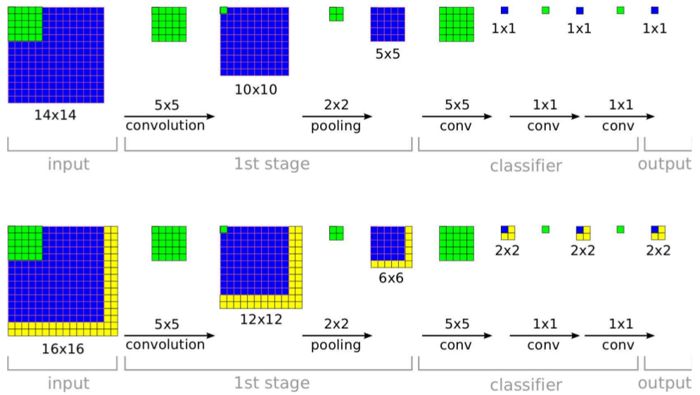
* 在测试时将全连接层替换成1\*1的卷积层
* 允许测试时输入不同大小的图像，等价与传统的滑动窗口方法，滑动步长取决于Pooling的次数。

### 主要创新点
* offset pooling
* 测试时将全连接层替换成1\*1的卷积层
* 测试时使用不同大小图像作为的输出(Multi-Scale)
* 卷积层参数共享: 固定卷积层的参数，将分类层替换层回归层，用于定位和检测。

[返回顶部](#detector)

------
## R-CNN
[R-CNN](https://arxiv.org/abs/1311.2524)
第一次将CNN应用到目标检测上，在目标检测领域取得了巨大突破。

### Object detection system overview

* 候选区域(Region proposals)：使用传统的区域提取方法，
通过滑动不同宽高的窗口获得了2K个潜在的候选区域。
* 使用CNN提取特征：将每个候选区域‘reSize’到固定大小，最终获得了4096维的特征。
* 使用SVM进行分类：每类训练一个SVM进行分类。注，作者测试使用softmax时mAP下降了3.3。
* 位置精修(Bounding-box regression, 边框回归)：提升了3-4mAP.

### 主要创新点
* 将CNN应用于目标检测
* 训练数据稀缺时，可以先从其他大的数据集进行预训练，然后在小数据集上进行微调(fine-tune)

[返回顶部](#detector)

------
## SPP-net
[SPP-net](https://arxiv.org/abs/1406.4729)
利用空间金字塔池化，使得任意大小的特征图都能够转换成固定大小的特征向量。
从而解决了CNN的输入必须是固定尺寸的问题，实现了多尺度输入。
因此SPP-net只需对原图做一次卷积，节省了大量的计算时间，比[R-CNN](#r-cnn)有24～102倍的提速。  
另外，SPP对分类性能也有帮助，获得了2014年imageNet挑战中检测的第二名和分类的第三名。
另外两个是VGG和GoogLeNet，
相关内容请参考[Classifier](https://github.com/mandeer/Classifier)工程。

### SPPNet structure
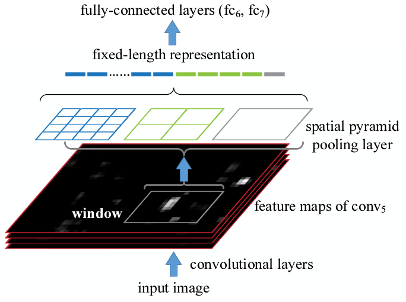
* 使用卷积网络提取特征：每幅图只做一次卷积，而不是每个候选区域做一次卷积运算。
* 将候选区域映射到最后一层的feature map上，然后使用SPP得到固定长度的特征。
* 使用SVM进行分类：同[R-CNN](#r-cnn)
* 边框回归：同[R-CNN](#r-cnn)

### 主要创新点
* 空间金字塔池化(spatial pyramid pooling, SPP)：对每个bins使用全局最大值池化，
得到的特征仅于bins和feature map的个数有关，与feature map的尺寸无关。
从而解决了CNN的输入必须是固定尺寸的问题，实现了多尺度输入。
* 多尺度输入的模型训练与测试方法：不同尺度输入的模型间参数共享。

[返回顶部](#detector)

------
## Fast
[Fast R-CNN](https://arxiv.org/abs/1504.08083)
把类别判断和边框回归统一到了一个深度网络框架中，首次实现了end-to-end(proposal阶段除外)的训练。

### Fast R-CNN architecture
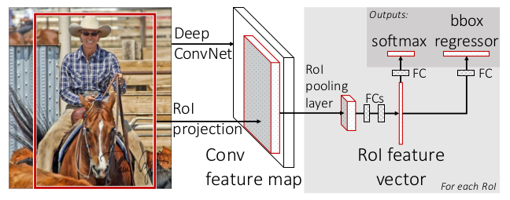
* 输入：整图及一系列候选区域
* 使用卷积网络提取特征
* RoI Pooling：为每个候选区域提取固定长度的特征。
* 分类、边框回归

### 主要创新点
* RoI pooling：仅有一层的[SPP](#spp-net)层，多尺度学习能提高一点点mAP，却成倍增加了计算量。
* Fine-tuning方法--分层采样：解决了[R-CNN](#r-cnn)和[SPP-net](#spp-net)训练低效的问题。
* Multi-task loss：Lcls & Lloc共享参数，mAP有约1%的提升。
* Smooth_L1 Loss：比L1 loss更鲁棒，比L2 loss对离群点更不敏感。

[返回顶部](#detector)

------
## Faster
[Faster R-CNN](https://arxiv.org/abs/1506.01497)
提出了RPN(Region Proposal Network), 终于将目标检测的四个基本步骤,
生成候选区域、特征提取、分类、边框回归统一到一个深度网络框架之中。  
Faster R-CNN的代码主要参考了
[这里](https://github.com/chenyuntc/simple-faster-rcnn-pytorch)

### Faster R-CNN architecture
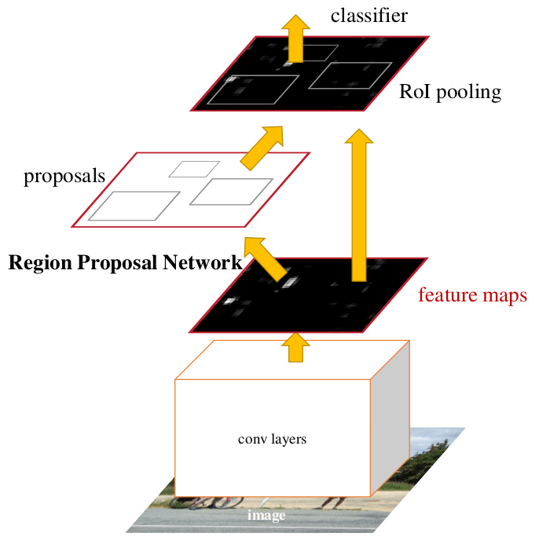
* 输入：整图
* 通过RPN网络得到proposal boxes
* 使用NMS(非最大值抑制)降低冗余
* 检测class得分比较高的候选区域

### 主要创新点
* Region Proposal Networks: 因为与Fast R-CNN共享特征，所以RPN几乎不消耗计算资源。
又因为RPN可以提高候选区域的质量，故提高了检出率。
* 候选区域、锚点(Anchors): 多尺度锚点解决了待检测目标拥有不同尺度和宽高比例的问题。
* RPN和Fast R-CNN共享特征的训练方法：
    * 从预训练模型W0开始，训练RPN，得到W1
    * 使用W1得到的候选区域及于训练模型W0，训练Fast R-CNN，得到W2
    * 使用W2，训练RPN，但固定前面的共享层，仅微调RPN独有的网络层，得到W3
    * 使用W3，训练Fast R-CNN，同样固定前面的共享层，仅训练Fast R-CNN独有的层，得到最终的W4
    * 重复上述过程得到的改进不大。

[返回顶部](#detector)

------
## FCN
[FCN](https://arxiv.org/abs/1605.06211)
提出了一种end-to-end、pixels-to-pixels的语义分割(Semantic Segmentation)方法，
是将CNN结构应用到图像语义分割领域并取得突出结果的开山之作，
因而拿到了CVPR 2015年的best paper honorable mention.

### FCN architecture
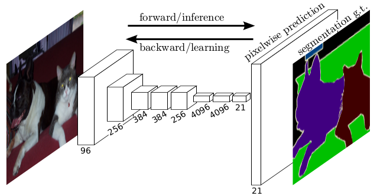  
* 使用语义分割的ground truth作为监督信息，训练了一个端到端、点到点的网络。

### 卷积化(convolutionalization)
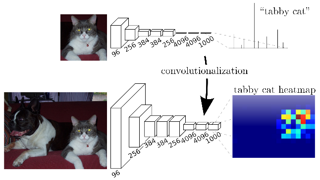  
* 将全连接层替换成卷积层，因此FCN可以接受任意尺寸的输入图像从而进行密集预测。

### 跳跃结构(skip layers)
  
* 使用反卷积(转置卷积)和跳跃结构，融合深层粗略的全局信息和浅层精细的局部信息。
* 全局信息解决的“是什么”，而局部信息解决的是“在哪里”

### 主要创新点
* 卷积化
* 使用反卷积进行上采样
* 使用跳跃结构融合深层和浅层的特征

[返回顶部](#detector)

------
## R-FCN
[R-FCN](https://arxiv.org/abs/1605.06409)
使用位置敏感得分图(position-sensitive score maps),
解决了图像分类(平移不变性)和物体检测(平移变换性)两者间的矛盾，
从而解决了[Faster R-CNN](#faster)中部分卷积层无法共享计算的问题。

### R-FCN architecture
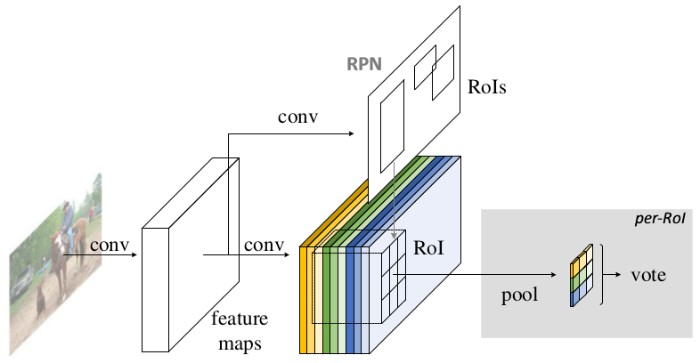
* 在ROI层之后，没有可学习的层，从而加快了训练和测试的速度

### position-sensitive RoI pooling

### 主要创新点
* 位置敏感得分图
    * 使用1\*1的卷积得到K^2(C+1)维的位置敏感得分图
    * 位置敏感的ROI Pooling：具体的pooling细节参考上图
    * 投票(vote, 均值)得到C+1维的向量
    * softmax or bbox regression(4K^2)

[返回顶部](#detector)

------
## FPN
[FPN](https://arxiv.org/abs/1612.03144)
提出了一种简单的在卷积网络内部构建特征金字塔的框架，即使卷积网络对目标的尺度变化有很强的鲁棒性，
特征金字塔仍然可以显著的改进原始网络的性能。

### FPN architecture
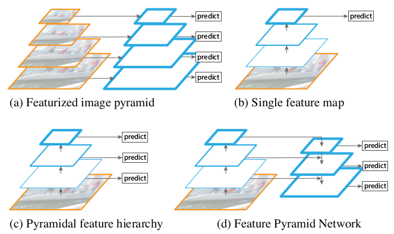
* Bottom-up pathway: 骨干网络，以卷积和降采样的方式提取特征
* Top-down pathway: 上采样深层粗粒度特征，提高深层特征的分辨率
* lateral connections: 融合浅层特征和深层特征

### 主要创新点
* 特征金字塔：低层的特征语义信息比较少，但是目标位置准确；
高层的特征语义信息比较丰富，但是目标位置比较粗略。
二者联合得到了在不同分辨率都拥有丰富语义特征的特征金字塔。

[返回顶部](#detector)

------
## Mask
[Mask R-CNN](https://arxiv.org/abs/1703.06870)
通过在[Faster R-CNN](#faster)基础上添加了一个用于预测目标掩模的新分支(mask branch)，
在没有增加太多计算量，且没有使用各种trick的前提下，在COCO的一系列挑战任务
(instance segmentation, object detection & person keypoint detection)中
**都**取得了领先的结果。  
作者开源了caffe2的[Mask R-CNN代码](https://github.com/facebookresearch/Detectron)

### 什么是实例分割
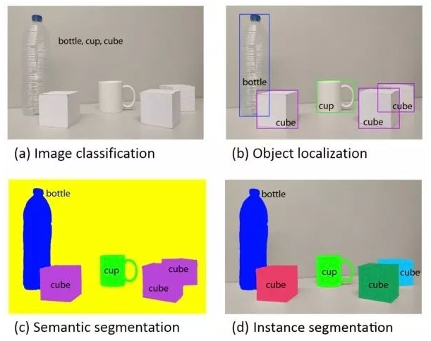

### Mask R-CNN 框架
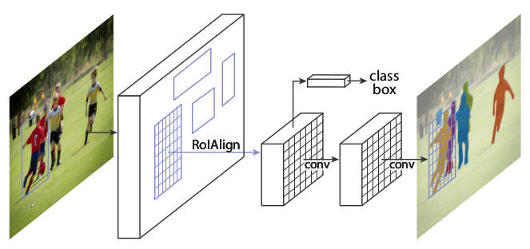
* 在Faster R-CNN的第二级上添加了与class和bbox并行的mask分支。
* multi-task loss: L = Lcls + Lbox + Lmask

### ROIAlign
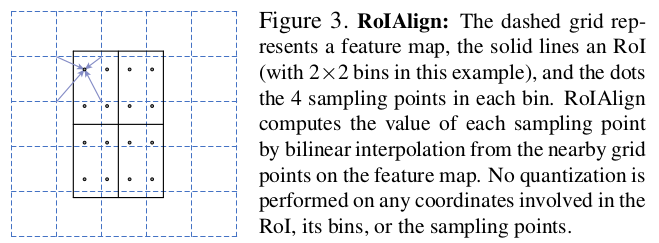
* 对feature map进行线性插值后再使用Pooling，
ROIPooling的量化操作(rounding)会使mask与实际物体位置有一个微小的偏移(8 pixel)

### 主要创新点
* mask分支：mask任务对分类和检测性能有帮助。
* [ROIAlign](#roialign): ROI校准，解决了mask的偏移问题。同时对检测性能也有提升。
* Lmask: 逐像素 sigmoid 的平均值，每类单独产生一个mask，依靠class分支获取类别标签。
将掩模预测和分类预测拆解，没有引入类间竞争，从而大幅提高了性能。

[返回顶部](#detector)

------
## MaskX
[Learning to Segment Every Thing](https://arxiv.org/abs/1711.10370)
是指使用只有部分类别标注了mask label(但所有类别都标注了bbox label)的数据，
训练出可以分割所有类别(包括没有mask标注的类)的模型。
利用迁移学习的思想，通过在[Mask R-CNN](#mask)的原架构上添加了一个
权重传递函数(weight transfer function)实现了这一目标。

### 分割示例
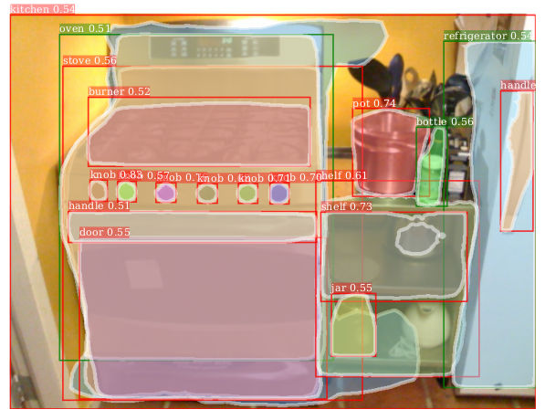
* 图中绿框表示有mask标注的类，红框表示只有bbox标注的类
* 可以很方便的从mask转换成bbox。反过来呢，提取的BBox特征是否对mask也有帮助？

### Mask^X R-CNN method

* 设A类有mask和bbox的标注，B类仅有bbox的标注
* 使用A和B共同训练标准的目标检测(注意，A和B的训练需要是同质的)
* 仅使用A训练mask和权重传递函数
* 在推理时，权重传递函数用于预测每个类别的实例分割参数，
从而使模型能够分割所有目标的类别。

### 主要创新点
* 开创了了一个令人兴奋的新的大规模实例分割的研究方向。
* 权重传递函数：链接了bbox和mask，将box head的特征迁移到mask head中，
这样对于缺乏mask ground-truth的类别，只要有box ground-truth，依然可以进行有效分割。
* 结合MLP和FCN：FCN更多的关注于细节，而MLP可以提取全局(主要)特征。

[返回顶部](#detector)

------
## DetectorNet
[DetectorNet](http://papers.nips.cc/paper/5207-deep-neural-networks-for-object-detection.pdf)
将目标检测看做是一个回归问题，证明了基于DNN的目标掩码回归也可以捕捉到强烈的几何信息。

### DetectorNet框架
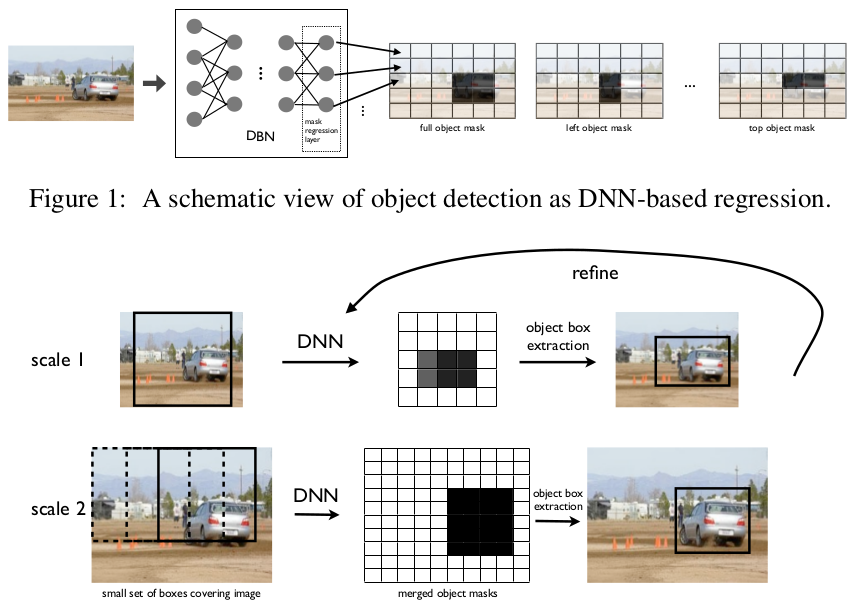
* 输出是full, left, right, top, bottom共5个mask, 其中后四个是半框, 图1仅显示了其中3个。
* scale1: multi-scale + 滑动窗口(子窗口)
* scale2: 精细化调整, bboxs放大1.2倍后，再跑一遍

### 主要创新点
* 目标函数添加正则化约束: 解决正负标签不均衡问题。
* 5个Mask: full, left, right, top, bottom
    * 解决目标重叠问题
* multi-scale + 精细化调整(refinement): 
    * 解决由于mask比较小, 无法精确定位的问题。

[返回顶部](#detector)

------
## DenseBox
[DenseBox](https://arxiv.org/abs/1509.04874)

[返回顶部](#detector)

------
## YOLO
[YOLO](https://arxiv.org/abs/1506.02640)

[返回顶部](#detector)

------
## YOLO9000
[YOLO9000](https://arxiv.org/abs/1612.08242)

[返回顶部](#detector)

------
## YOLOv3
[YOLOv3](https://pjreddie.com/publications/)

### 性能对比
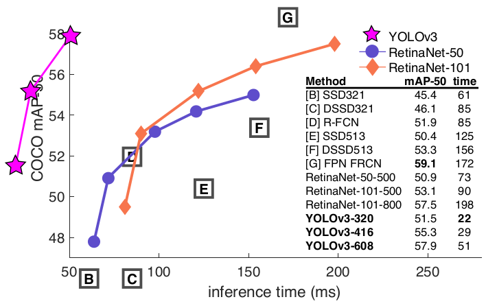

[返回顶部](#detector)

------
## SSD
[SSD](https://arxiv.org/abs/1512.02325)

[返回顶部](#detector)

------
## DSSD
[DSSD](https://arxiv.org/abs/1701.06659)

[返回顶部](#detector)

------
## RetinaNet
[RetinaNet](https://arxiv.org/abs/1708.02002)

[返回顶部](#detector)

更多有关目标检测的论文，请参考
[这里](https://www.cnblogs.com/zlslch/p/6970680.html)  
想要查看VOC2012的排行榜请点击
[这里](http://host.robots.ox.ac.uk:8080/leaderboard/displaylb.php?challengeid=11&compid=4)

  
  
