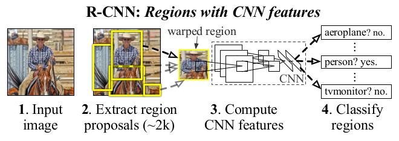

# Detector
使用PyTorch实现了经典的深度学习检测算法：
* [R-CNN](#r-cnn)(2013.11)
* [SPP-net](#spp-net)(2014.6)
* [Fast R-CNN](#fast)(2015.4)
* [**Faster R-CNN**](#faster)(2015.6)
* [**Mask R-CNN**](#mask)(2017.3)
* [YOLO](#yolo)(2015.6)
    * [**YOLO9000**](#yolo9000)(2016.12)
* [**SSD**](#ssd)(2015.12)

------
## Requisites:
* anaconda
* pytorch-0.3.0
* torchvision
* visdom

------
## 经典的传统目标检测算法
* Haar + AdaBoost
    * 参考论文1：Rapid Object Detection using a Boosted Cascade of Simple Features,
    Viola & Jones, 2001
    * 参考论文2：Robust Real-Time Face Detection, Viola & Jones, 2002
    * 参考论文3：Informed Haar-Like Features Improve Pedestrian Detection,
    ShanShan Zhang等, 2014
* LBP + AdaBoost
    * 参考论文1：Multiresolution gray-scale and rotation invariant 
    texture classification with local binary patterns, Ojala等, 2002
    * 参考论文2：Learning Multi-scale Block Local Binary Patterns for Face Recognition,
    Shengcai Liao, 2007
    * 参考论文3：局部二值模式方法研究与展望, 宋克臣, 2013
* HOG + SVM(Cascade)
    * 参考论文1：Histograms of Oriented Gradients for Human Detection,
    Dalal & Triggs, 2005
    * 参考论文2：Fast Human Detection Using a Cascade of Histograms of Oriented 
    Gradients, Qiang Zhu等, 2006
* ACF + AdaBoost
    * 参考论文1：Integral Channel Features, Piotr Dollar等, 2009
    * 参考论文2：Fast Feature Pyramids for Object Detection, Piotr Dollar等, 2014
    * 参考论文3：Local Decorrelation For Improved Detection, Piotr Dollar等, 2014
* DPM
    * 参考论文1：A Discriminatively Trained, Multiscale, Deformable Part Model,
    Pedro等， 2008
    * 参考论文2：Object Detection with Discriminatively Trained Part Based Models,
    Pedro & ross等, 2010
    * 参考论文3：Visual Object Detection with Deformable Part Models, Pedro & ross等,
    2013
    * 参考论文4：Deformable Part Models are Convolutoinal Neural Networks,
    ross等, 2015  
本工程主要实现基于深度学习的检测算法，对传统算法感兴趣的同学可以阅读上面列出的论文，或相关博客。

[返回顶部](#detector)

------
## 前排膜拜大牛
* Ross Girshick(rbg): [个人主页](http://www.rossgirshick.info/), 主要成就：
    * DPM
    * R-CNN
    * Fast R-CNN
    * Faster R-CNN
    * YOLO
* Kaiming He(何恺明): [个人主页](http://kaiminghe.com/), 主要成就：
    * 2003年广东省理科高考状元
    * 图像去雾
    * ResNet
    * MSRA 初始化
    * Group 正则化
    * PReLU
    * SPPNet
    * Faster R-CNN
    * Mask R-CNN
    * 炉石传说

[返回顶部](#detector)

------
## R-CNN
[R-CNN](https://arxiv.org/abs/1311.2524)
第一次将CNN应用到目标检测上，在目标检测领域取得了巨大突破。

### Object detection system overview

* 候选区域(Region proposals)：使用传统的区域提取方法，
通过滑动不同宽高的窗口获得了2K个潜在的候选区域。
* 使用CNN提取特征：将每个候选区域‘reSize’到固定大小，最终获得了4096维的特征。
* 使用SVM进行分类：每类训练一个SVM进行分类。注，作者测试使用softmax时mAP下降了3.3。
* 位置精修(Bounding-box regression, 边框回归)：提升了3-4mAP.

### 主要创新点
* 将CNN应用于目标检测
* 训练数据稀缺时，可以先从其他大的数据集进行预训练，然后在小数据集上进行微调(fine-tune)

[返回顶部](#detector)

------
## SPP-net
[SPP-net](https://arxiv.org/abs/1406.4729)
利用空间金字塔池化，使得任意大小的特征图都能够转换成固定大小的特征向量。
从而解决了CNN的输入必须是固定尺寸的问题，实现了多尺度输入。
因此SPP-net只需对原图做一次卷积，节省了大量的计算时间，比[R-CNN](#r-cnn)有24～102倍的提速。  
另外，SPP对分类性能也有帮助，获得了2014年imageNet挑战中检测的第二名和分类的第三名。
另外两个是VGG和GoogLeNet，
相关内容请参考[Classifier](https://github.com/mandeer/Classifier)工程。

### SPPNet structure

* 使用卷积网络提取特征：每幅图只做一次卷积，而不是每个候选区域做一次卷积运算。
* 将候选区域映射到最后一层的feature map上，然后使用SPP得到固定长度的特征。
* 使用SVM进行分类：同[R-CNN](#r-cnn)
* 边框回归：同[R-CNN](#r-cnn)

### 主要创新点
* 空间金字塔池化(spatial pyramid pooling, SPP)：对每个bins使用全局最大值池化，
得到的特征仅于bins和feature map的个数有关，与feature map的尺寸无关。
从而解决了CNN的输入必须是固定尺寸的问题，实现了多尺度输入。
* 多尺度输入的模型训练与测试方法：不同尺度输入的模型间参数共享。

[返回顶部](#detector)

------
## Fast
[Fast R-CNN](https://arxiv.org/abs/1504.08083)
把类别判断和边框回归统一到了一个深度网络框架中，首次实现了end-to-end(proposal阶段除外)的训练。

### Fast R-CNN architecture

* 输入：整图及一系列候选区域
* 使用卷积网络提取特征
* RoI Pooling：为每个候选区域提取固定长度的特征。
* 分类、边框回归

### 主要创新点
* RoI pooling：仅有一层的[SPP](#spp-net)层，多尺度学习能提高一点点mAP，却成倍增加了计算量。
* Fine-tuning方法--分层采样：解决了[R-CNN](#r-cnn)和[SPP-net](#spp-net)训练低效的问题。
* Multi-task loss：Lcls & Lloc共享参数，mAP有约1%的提升。
* Smooth_L1 Loss：比L1 loss更鲁棒，比L2 loss对离群点更不敏感。

[返回顶部](#detector)

------
## Faster
[Faster R-CNN](https://arxiv.org/abs/1506.01497)
提出了RPN(Region Proposal Network), 终于将目标检测的四个基本步骤,
生成候选区域、特征提取、分类、边框回归统一到一个深度网络框架之中。

### Faster R-CNN architecture

* 输入：整图
* 通过RPN网络得到proposal boxes
* 使用NMS(非最大值抑制)降低冗余
* 检测class得分比较高的候选区域

### 主要创新点
* Region Proposal Networks: 因为与Fast R-CNN共享特征，所以RPN几乎不消耗计算资源。
又因为RPN可以提高候选区域的质量，故提高了检出率。
* 候选区域、锚点(Anchors): 多尺度锚点解决了待检测目标拥有不同尺度和宽高比例的问题。
* RPN和Fast R-CNN共享特征的训练方法：
    * 从预训练模型W0开始，训练RPN，得到W1
    * 使用W1得到的候选区域及于训练模型W0，训练Fast R-CNN，得到W2
    * 使用W2，训练RPN，但固定前面的共享层，仅微调RPN独有的网络层，得到W3
    * 使用W3，训练Fast R-CNN，同样固定前面的共享层，仅训练Fast R-CNN独有的层，得到最终的W4
    * 重复上述过程得到的改进不大。

[返回顶部](#detector)

------
## Mask
[Mask R-CNN](https://arxiv.org/abs/1703.06870)

[返回顶部](#detector)

------
## YOLO
[YOLO](https://arxiv.org/abs/1506.02640)

[返回顶部](#detector)

------
## YOLO9000
[YOLO9000](https://arxiv.org/abs/1612.08242)

[返回顶部](#detector)

------
## SSD
[SSD](https://arxiv.org/abs/1512.02325)

[返回顶部](#detector)

  
  
